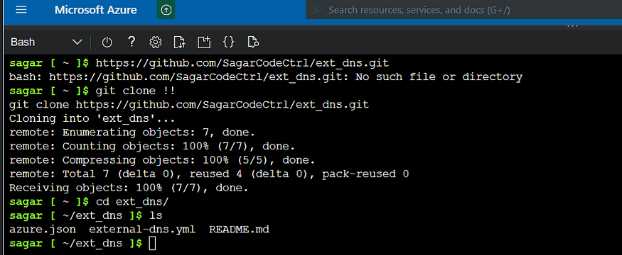
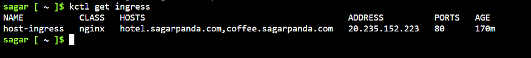

# Nginx Ingress for Kubernetes - Domain Based Routing with TLS


## Introduction:

In Kubernetes, “Ingress” is an API object that manages external access to services within a cluster.
It acts as a layer above the services, providing routing rules and load balancing for HTTP and HTTPS traffic. Essentially, it allows you to define how external traffic should be directed to services based on rules you set up, such as hostnames, paths, or other HTTP headers.
Ingress typically works in conjunction with Ingress Controllers, which are responsible for actually implementing the routing rules.
There are multiple vendors implementing ingress api and nginx is one such.


## Getting started:
- Create an alias for `kubectl` command [Optional]
```bash
alias kctl=kubectl
```
- First create deployments of your app.
```bash
kctl create deployment appname --image=<name>
```


- Expose the deployments with just cluster ip, as we are going to manage external traffic with ingress.


- Note that these are only cluster IPs and can’t be accessed outside of the cluster.


## Install Nginx ingress controller:
- To create a Nginx controller, clone the official repo and apply the manifest.

- https://github.com/kubernetes/ingress-nginx
- The location of the manifest deploy/static/provider/cloud.
- This creates a namespace called `Ingress- nginx`
```bash
kctl apply -f deploy.yml
```


- Get nginx ip and browse.

```bash
kctl get svc -n ingress-nginx
```
- As of now it’s just the nginx, no application is served here so we’ll see a 404 response.


- Now create an ingress resource which points the controller with the deployments.

```yml
apiVersion: networking.k8s.io/v1
kind: Ingress
metadata:
 name: myapp-ingress
 annotations:
  kubernetes.io/ingress.class: nginx
spec:
 ingressClassName: nginx 
 rules:
 - http:
    paths:
    - path: /
      pathType: Prefix
      backend:
       service:
         name: hotel
         port:
          number: 80
    - path: /tea
      pathType: Prefix
      backend:
       service:
         name: tea
         port:
          number: 80
    - path: /coffee
      pathType: Prefix
      backend:
       service:
         name: coffee
         port:
          number: 80
```
- Here we define the ingress class name as nginx.
- Apply and browse the ip of the ingress controller.

```bash
sagar [ ~ ]$ kctl apply -f ingress.yml 
ingress.networking.k8s.io/myapp-ingress created
sagar [ ~ ]$ 
```
- And we can see our app being served.


## Prefix vs Exact path types:

A prefix path type will always route to the destination even if the url doesn’t exist. For example ip/tea and ip/teaxyz will still make tea app to load.
Exact path type loads only when the path matches the url otherwise return a 404 page.

```yml
 - path: /tea
      pathType: Exact
      backend:
       service:
         name: tea
         port:
          number: 80
```

- ## With prefix:


- ## With exact:


## Domain Based Routing:

- Now that we have our app running on k8s, lets do domain mapping so we can share our app with public/customer.
If you have domain outside of azure, then add the name server from azure.
Create dns zone. Add the name server to your provider to be able to manage dns records from azure itself.


- Now create a managed identity

- Assign contributor role to the identity. (You can use even service principals)

- Add any external dns. Update the json with azure ac details.

- Add the identity to vm scale set.
- Create secret based on the azure.json and apply the external dns yaml. The yaml uses this secret.

- And apply the external dns.

- Now apply the ingress resource.
```bash
kctl apply -f named_ingress.yml
```
```yml
apiVersion: networking.k8s.io/v1
kind: Ingress
metadata:
 name: host-ingress
 annotations:
  kubernetes.io/ingress.class: nginx
spec:
 ingressClassName: nginx
 rules:
 - host: hotel.sagarpanda.com
   http:
    paths:
    - path: /
      pathType: Exact
      backend:
       service:
         name: hotel
         port:
          number: 80
 
 - host: coffee.sagarpanda.com
   http:
    paths:
    - path: /
      pathType: Exact
      backend:
       service:
         name: coffee
         port:
          number: 80 
```
 - Once we do that, we can see dns records getting created automatically.


- get ip of the ingress and browse.
```bash
kctl get ingress
```


- There we go. Our ingress is working fine and routing works fine.


## Adding TLS:
 - Now that our app is set and working fine, lets add ssl certificate.
- Note: Here I’m using lets encrypt cert. First we need to install the cert manager.

```bash
kubectl apply -f https://github.com/cert-manager/cert-manager/releases/download/v1.14.4/cert-manager.yaml
```


- Create a certIssuer with cert provider details.
```yml
apiVersion: cert-manager.io/v1
kind: ClusterIssuer
metadata:
  name: letsencrypt-prod
spec:
  acme:
    server: https://acme-v02.api.letsencrypt.org/directory
    email: your-email@example.com  #use valid mail or it wont work
    privateKeySecretRef:
      name: letsencrypt-prod
    solvers:
    - http01:
        ingress:
          class: nginx
```
- Get the secret created.


- Update the ingress with the TLS details.
```yml
apiVersion: networking.k8s.io/v1
kind: Ingress
metadata:
  name: host-ingress
  annotations:
    kubernetes.io/ingress.class: nginx
    cert-manager.io/cluster-issuer: letsencrypt-prod
spec:
  ingressClassName: nginx
  rules:
  - host: hotel.sagarpanda.com
    http:
      paths:
      - path: /
        pathType: Prefix
        backend:
          service:
            name: hotel
            port:
              number: 80
  - host: coffee.sagarpanda.com
    http:
      paths:
      - path: /
        pathType: Prefix
        backend:
          service:
            name: coffee
            port:
              number: 80
  tls:
  - hosts:
    - hotel.sagarpanda.com
    - coffee.sagarpanda.com
    secretName: sagarpanda-tls-secret-lqblm
```
- And finally, we have TLS cert.


- View the cert details:


There you go. Our app running on k8s with nginx ingress using our own domain.
